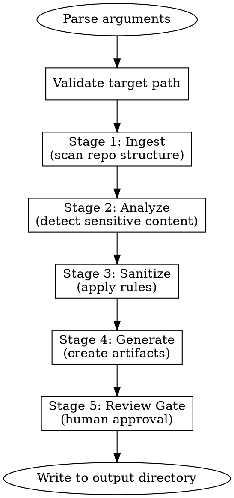

# Shadow-Clone

Create quick portfolios and code summaries for easier digest.

## Quick Reference

| Flag | Purpose |
|------|---------|
| `--readme-only` | Generate README only |
| `--diagrams-only` | Generate architecture diagrams only |
| `--safe-code-only` | Extract safe code pack only |
| `--config FILE` | Use config file |
| `--rules "..."` | Natural language rules |
| `--output DIR` | Output directory (default: `./shadow-clone-output/`) |
| `--mode MODE` | `conservative` (default) or `moderate` |
| `--file PATH` | Target specific file |
| `--folder PATH` | Target specific folder |
| `--include GLOB` | Include by glob pattern |

## Invocation

```bash
# Full pipeline (default)
/shadow-clone /path/to/repo

# Specific outputs
/shadow-clone /path/to/repo --readme-only
/shadow-clone /path/to/repo --diagrams-only
/shadow-clone /path/to/repo --safe-code-only

# With natural language rules
/shadow-clone /path/to/repo --rules "exclude billing logic, keep infrastructure code"

# Target specific code
/shadow-clone /path/to/repo --folder src/infrastructure/
```

## Workflow



## Stage Details

### Stage 1: Ingest
- Scan repository structure
- Build file tree
- Detect project type (language, framework)
- Load config file if present

### Stage 2: Analyze
- **Secret scanning** - API keys, credentials, tokens
- **IP detection** - Proprietary algorithms, business logic
- **PII scanning** - Names, emails, internal URLs
- Build sensitivity map per file

### Stage 3: Sanitize
- Apply allow/deny rules
- Redact sensitive content
- Generate placeholder replacements

### Stage 4: Generate
Based on mode flags, generate:
- **README** - Project overview, tech stack, architecture summary
- **Diagrams** - Mermaid architecture diagrams
- **Safe Code Pack** - Allowlisted files with sanitization applied

### Stage 5: Review Gate
- Display summary of what will be published
- Show any warnings or flagged content
- **Require explicit user approval before output**

## Output Structure

```
shadow-clone-output/
├── README.md
├── docs/
│   ├── architecture.md
│   └── flows/
├── public/           # Safe code pack
│   ├── infrastructure/
│   └── utils/
└── .shadow-clone-meta.json  # Provenance
```

## Safety Principles

1. **Deny by default** - Nothing published without explicit allowlist
2. **Human in the loop** - Always prompt for review before output
3. **Provenance tracking** - Record what was sanitized and why
4. **Conservative mode** - Default to maximum safety

## README Generation (`--readme-only`)

When invoked with `--readme-only`, follow this process:

### Step 1: Scan Repository Structure

Use Glob and Read to gather:
```
- package.json, requirements.txt, go.mod, Cargo.toml (dependencies)
- README.md (existing, if any)
- src/, lib/, app/ structure
- Dockerfile, docker-compose.yml
- .github/workflows/, Jenkinsfile, .gitlab-ci.yml (CI/CD)
- terraform/, infrastructure/, deploy/ (IaC)
```

### Step 2: Detect Tech Stack

Build a tech stack table from detected files:

| Indicator File | Technology |
|----------------|------------|
| `package.json` | Node.js + listed dependencies |
| `requirements.txt` / `pyproject.toml` | Python + listed packages |
| `go.mod` | Go |
| `Cargo.toml` | Rust |
| `Dockerfile` | Docker |
| `*.tf` files | Terraform |
| `.github/workflows/` | GitHub Actions |

### Step 3: Generate README Sections

**Template:**

```markdown
# {Project Name}

> {One-line description - infer from existing README or package.json description}

## Overview

{AI-generated narrative: 2-3 paragraphs covering:
- What problem does this solve?
- What approach was taken?
- Key constraints or requirements}

## Tech Stack

| Layer | Technologies |
|-------|--------------|
| {layer} | {detected technologies} |

## Architecture

{If diagrams requested, embed mermaid. Otherwise:}
See [docs/architecture.md](docs/architecture.md) for system diagrams.

## Key Features

{Extract from existing README or infer from code structure:}
- Feature 1: Brief description
- Feature 2: Brief description

## My Contributions

{Placeholder for user to fill:}
- Designed and implemented [specific system/component]
- Led [initiative] resulting in [outcome]

## Code Highlights

{If safe code pack exists:}
See [/public](/public) for sanitized examples of:
- Infrastructure patterns
- API design
- Testing strategies

---

*Generated with shadow-clone on {date}*
```

### Step 4: Review Gate

Before writing output, display:
1. Preview of generated README
2. List of detected technologies
3. Any warnings (e.g., "No existing README found")

Ask user: **"Write this README to {output_path}? (yes/no)"**

### Step 5: Write Output

If approved, write to:
- `{output_dir}/README.md`
- Update `.shadow-clone-meta.json` with generation metadata

---

## Implementation Status

| Component | Status |
|-----------|--------|
| Argument parsing | Basic |
| Secret scanning | Not started |
| README generation | **Implemented** |
| Diagram generation | Not started |
| Safe code pack | Not started |
| Review gate | Basic |
