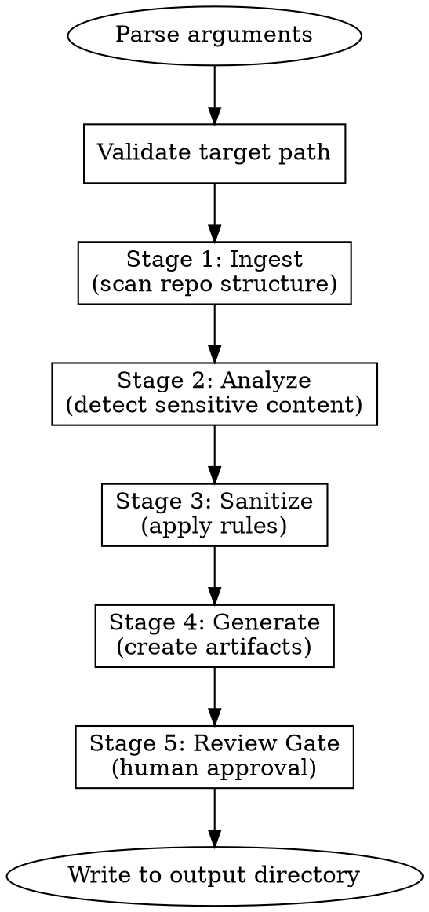

# Shadow-Clone

Transform private repositories into recruiter-ready portfolios while protecting IP.

## Quick Reference

| Flag | Purpose |
|------|---------|
| `--readme-only` | Generate README only |
| `--diagrams-only` | Generate architecture diagrams only |
| `--safe-code-only` | Extract safe code pack only |
| `--config FILE` | Use config file |
| `--rules "..."` | Natural language rules |
| `--output DIR` | Output directory (default: `./shadow-clone-output/`) |
| `--mode MODE` | `conservative` (default) or `moderate` |
| `--file PATH` | Target specific file |
| `--folder PATH` | Target specific folder |
| `--include GLOB` | Include by glob pattern |

## Invocation

```bash
# Full pipeline (default)
/shadow-clone /path/to/repo

# Specific outputs
/shadow-clone /path/to/repo --readme-only
/shadow-clone /path/to/repo --diagrams-only
/shadow-clone /path/to/repo --safe-code-only

# With natural language rules
/shadow-clone /path/to/repo --rules "exclude billing logic, keep infrastructure code"

# Target specific code
/shadow-clone /path/to/repo --folder src/infrastructure/
```

## Workflow



## Stage Details

### Stage 1: Ingest
- Scan repository structure
- Build file tree
- Detect project type (language, framework)
- Load config file if present

### Stage 2: Analyze
- **Secret scanning** - API keys, credentials, tokens
- **IP detection** - Proprietary algorithms, business logic
- **PII scanning** - Names, emails, internal URLs
- Build sensitivity map per file

### Stage 3: Sanitize
- Apply allow/deny rules
- Redact sensitive content
- Generate placeholder replacements

### Stage 4: Generate
Based on mode flags, generate:
- **README** - Project overview, tech stack, architecture summary
- **Diagrams** - Mermaid architecture diagrams
- **Safe Code Pack** - Allowlisted files with sanitization applied

### Stage 5: Review Gate
- Display summary of what will be published
- Show any warnings or flagged content
- **Require explicit user approval before output**

## Output Structure

```
shadow-clone-output/
├── README.md
├── docs/
│   ├── architecture.md
│   └── flows/
├── public/           # Safe code pack
│   ├── infrastructure/
│   └── utils/
└── .shadow-clone-meta.json  # Provenance
```

## Safety Principles

1. **Deny by default** - Nothing published without explicit allowlist
2. **Human in the loop** - Always prompt for review before output
3. **Provenance tracking** - Record what was sanitized and why
4. **Conservative mode** - Default to maximum safety

## Implementation Status

| Component | Status |
|-----------|--------|
| Argument parsing | Not started |
| Secret scanning | Not started |
| README generation | Not started |
| Diagram generation | Not started |
| Safe code pack | Not started |
| Review gate | Not started |
